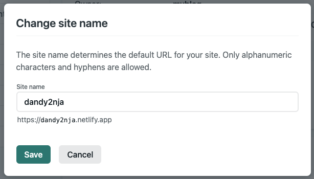

# はじめに

最近ペネトレーションテストの実技資格であるOSCPの勉強を始めました。
主にHack the Boxを活用して勉強を進めていますが、前々からアウトプットの場を整備しなければと思っていたこともあり、Write-upを投稿するためのブログを作成することにしました。

セキュリティを本業にしているため、仕事とは別にセキュリティの不安で怯えたくないと考えながら下調べをしていたところ、事前にサイトをビルドし静的なコンテンツをデプロイする`Jamstack (JavaScript/APIs/Markup)`なる技術があることを知りました。
セキュリティ面のメリットもさることながら、静的コンテンツをデプロイしているためコンテンツの表示速度にも優れているそうです。

今回はJamstackの中でも事例が多い`Gatsby`を採用し、ホスティング先は`Netlify`にしました。
Gatsbyでブログを作成しNetlifyにデプロイした上で、Google Domainsで取得した独自ドメインを設定するところまでを実施したいと思います。

# Gatsby公式チュートリアルの実施

`Gatsby + Netlify`は採用例が多く、qiitaにも数多くの作成手順が掲載されています。
おそらくそれに従う方が早くブログは完成しますが、今後のカスタマイズや自身の技術力（WEB界隈は疎い）を考え、Gatsbyの公式ドキュメントにそってブログを作成することにしました。

Gatsby公式ドキュメント（チュートリアル）
https://www.gatsbyjs.com/docs/

Quick Startは中級〜上級者向けで、初心者はチュートリアルの実施が推奨されています。本記事ではチュートリアルの内容に沿って、ブログを作成します。

## 0. Set Up Your Development Environment

### Homebrewのインストール

割愛

### Xcodeのインストール

XCodeのコマンドラインツールをAppleのサイト（`https://developer.apple.com/download/more/`）からダウンロードしてインストールします。

記事執筆時点では`Command Line Tools for Xcode 12.5 beta 3`が最新バージョンでしたが、安定版の12.4をインストールしました。

### Nodeのインストール

HomebrewからNodeをインストールします。

```
brew install node
```

インストール確認。
```
% npm --version
7.7.6
% node --version
v15.14.0
```

### Gitのインストール

割愛

### GatsbyCLIの使用

npm経由で`gatsby-cli`をインストールします。

```
npm install -g gatsby-cli
```

インストール確認。
```
% gatsby --version
Gatsby CLI version: 3.2.0
```

先ほどgatsby-cliをインストールした時にnpmのnoticeが出ていました。
```
npm notice
npm notice New minor version of npm available! 7.7.6 -> 7.9.0
npm notice Changelog: https://github.com/npm/cli/releases/tag/v7.9.0
npm notice Run npm install -g npm@7.9.0 to update!
npm notice
```

新バージョンが利用できるよ！とアピールしているので大人しく従います。
```
npm install -g npm@7.9.0
```

インストール確認。
```
% npm --version
7.9.0
```

### Gatsbyのサイトを作成

Gatsby公式のスターターを利用してサイトを作成します。
チュートリアルでは`gatsby-starter-hello-world`というスターターを利用していますが、今回は他ブログでも採用事例が多い`gatsby-starter-blog`を利用することにしました。

```
gatsby new myblog https://github.com/gatsbyjs/gatsby-starter-blog
```

上記コマンドのmyblogは任意のタイトルです。
コマンドを実行するとカレントにmyblogディレクトリが作成されますので、作成されたディレクトリに移動してサイトを生成します。
```
cd myblog
gatsby develop
```

### ローカルでサイトを表示

ブラウザで生成したローカルサイト`http://localhost:8000/`にアクセスします。無事にサイトが表示されました。


### コードエディターの設定

チュートリアルではVS Codeと`Prettier`プラグインが紹介されていました。
VS Codeは導入済みだったので`Prettier`だけインストールしました。

## 1. Get to Know Gatsby Building Blocks

今の状態ではKyle Mathewsさんのブログとなっています。
チュートリアルでは`gatsby-starter-hello-world`を用いてコード編集をしていますが、ここではチュートリアル内容を咀嚼して、生成したサイトを編集します。

### コードを開く
VS Codeで作成したブログのコードを開きます。
`README.md`にはGatsbyのプロジェクト構造が記載されていますので確認しておきましょう。
今回は自分のブログとして公開することにフォーカスし、下記順番で設定をイジっていきます。

1. `gatsby-config.js` サイトの設定項目が詰まっています。ブログタイトルをはじめとしたメタデータもここ。
1. `/src` ソースコードが格納されています。ヘッダーやフッター、ページテンプレートを弄るときはここです。
1. `/content/blog` ブログコンテンツである記事や画像が格納されています。初期では3つのサンプル記事が存在します。

### Gatsbyに慣れる
まずはサイトのメイン設定ファイルである`gatsby-config.js`を変更します。

サイトメタデータは全般的に修正が必要ですね。私は以下の通り書き換えました。
```
siteMetadata: {
  title: `Dandy Hackers Lab`,
  author: {
    name: `Dandy (Keisuke Kato)`,
    summary: `who works as Security Consultant.`,
  },
  description: `Dandy's Tech and Security Blog.`,
  siteUrl: `https://dandy2nja.dev/`,
  social: {
    twitter: `dandy2nja`,
  },
},
```

configファイルを上書きするとすぐにページに変更されます。
Twitterのリンクも書き変わっていました。


### コンポーネントを使用した構築

`/src/pages/*.js`に格納すると自動的にページになるようです。
初期状態では`404.js`と`index.js`が存在します。
たとえば`404.js`のページを参照したい場合は、`http://localhost:8000/404`にアクセスします。


チュートリアルでは`about.js`を作成していますが、本記事では省略します。
各自必要なページがあれば追加してください。

ページを構成するコンポーネントは`/src/components`に格納されています。
現時点ではブログのアバター画像が他人のものになっていますので、これを変更します。
アバター画像は`/src/components/bio.js`の`bio`クラスで設定されているようです。

```
<div className="bio">
  <StaticImage
    className="bio-avatar"
    layout="fixed"
    formats={["AUTO", "WEBP", "AVIF"]}
    src="../images/profile-pic.png"
    width={50}
    height={50}
    quality={95}
    alt="Profile picture"
  />
  {author?.name && (
    <p>
      Written by <strong>{author.name}</strong> {author?.summary || null}
      {` `}
      <a href={`https://twitter.com/${social?.twitter || ``}`}>
        You should follow them on Twitter
      </a>
    </p>
  }
</div>
```

画像は`/src/images/profile-pic.png`に格納されているようなので、ファイルを差し替えてみました。


### サイトの展開

サイトの展開をする前にサンプル記事を削除しておきましょう。
サンプル記事は3つ、`/content/blog`に格納されています。

ブログ記事は`/content/blog`に作成したディレクトリへ`index.md`として配置します。
サンプル記事を削除し、新たに自分で作成したページを配置しておきます。
`/content/blog/first-post/index.md`として以下のサンプルページを作っておきました。

```
---
title: First Post!
date: "2021-04-11"
description: 投稿テスト
---

# はじめに

投稿テストです
```

こんな感じでページが作成されました。


# GitHubとNetlifyを活用したサイトの公開

## GitHubへプッシュ

まずはGihHubへサイトのソースコードをプッシュします。
リポジトリをPublicにするかPrivateにするか迷いましたが、ひとまずPublicにしておきました。
後から公開設定を変更したい場合は`Github > Settings > Danger Zone > Change repository visibility`で変更が可能です。

```
git remote add origin [GITHUB_REPOSITORY_URL]
git add .
git commit -a -m "first commit"
git push -u origin master
```
## Netlifyへデプロイ

Netlifyの管理画面にログインし、`New Site from Git`をクリックします。


GitHubのリポジトリからデプロイしますので、Continuous DeploymentはGitHubを選択します。


Permissionを確認し、`Authorize Netlify`をクリックします。


`Only select repositories`から先ほどサイトコードをプッシュしたリポジトリを選択し、`install`をクリックします。


自分の場合、なぜかページが終了してしまいました（通常遷移？）
`Create a new site`のページに戻り、Continuous DeploymentでGitHubを再度選択すると、パーミッションを承認したリポジトリが表示されますので、リポジトリを選択します。


build settingのBuild Commandを`gatsby build`に変更します。
その他問題がなければ`Deploy site`をクリックします。


GitHubからGatsbyサイトがデプロイされます。
デプロイが完了したら、サイトにアクセスします。URLは管理画面上に記載されています。


無事にサイトが表示されました。


## カスタムドメインの設定

NetlifyにホスティングするとNetlifyドメイン（netlify.app）がもらえます。
Google Domainsで`.dev`ドメイン（`dandy2nja.dev`）を取得しているので、これを利用して独自ドメインでブログを運用したいと思います。

## Netlifyサイト名の設定

最初はランダムのサイト名にNetlifyドメインが割り振られています。
サイト名を変更して分かりやすいドメインに変更していきましょう。

まずはNetlifyの管理ページから`Site setting`をクリックします。


`Site details > Site Information`の`Change site name`をクリックし、任意のサイト名に設定します。



サイト名変更後、すぐにアクセスURLも変更になります。
私はサイト名を`dandy2nja`に変更したので、ブログURLは`https://dandy2nja.netlify.app`となりました。

## カスタムドメインの設定

次にカスタムドメインをブログに設定します。
Netlifyの管理ページから`Domain setting`をクリックします。


`Domain management > Domains > Custom domains`で`Add custom domain`をクリックします。


Google Domainsで取得したドメイン（私の場合は`dandy2nja.dev`を入力し、`Verify`をクリックします。


入力したドメインは取得済みか、と聞かれるので`Yes, add domain`をクリックします。


カスタムドメインがPrimary domainとなり、NetlifyドメインがSub Domainとなります。
次にDNS設定をしますので、`Check DNS configuration`をクリックします。


AレコードのIPアドレスが記載されていますのでメモしておきます。
これはこの後、Google DomainsでDNS設定をする際に必要となります。


## DNSの設定

Google DomainsでDNSの設定をします。
管理コンソールを開き、`マイドメイン > [ドメイン名] > DNS`と進みます。
カスタム リソース レコードの設定でAレコードとCNAMEリソースレコードを定義します。
AレコードのIPアドレスはNetlify側で提示されたものを、CNAMEはwww付きのカスタムドメインを入力します。
wwwレコードの登録がないとNetlify側でhttpsが有効になりません。必ず登録しておきましょう。


## HTTPSの設定

DNSの設定後にNetlifyの管理コンソールを開き、`Sites > [ドメイン名] > Domain Setting > HTTPS`と進みます。
AレコードとCNAMEの反映は時間がかかりますが、反映が完了されていれば自動的にHTTPSが有効になっているはずです。


ブログURLにアクセスしてHTTPSとカスタムドメインの有効性を確認します。
私の場合は`https://dandy2nja.dev`がブログURLとなります。

# おわりに

無事ブログを公開することができました。
久しぶりにプログラミング言語を触り、楽しかったです。
デザインはスターターサイトそのものなので、今後デザインの変更やプラグインの導入を実施していきたいと思います。
